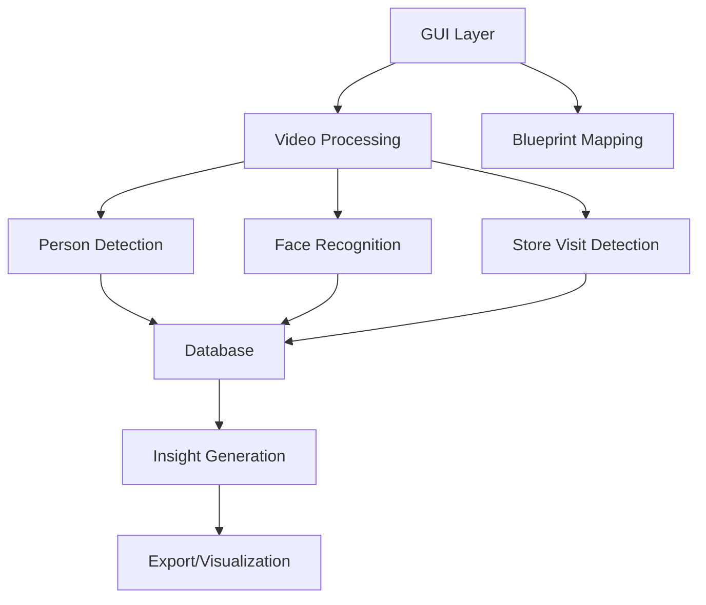

# Mall Blueprint Mapping and Analytics System Documentation

## Project Overview
This project is a sophisticated mall analytics system that combines computer vision, facial recognition, and machine learning to track and analyze customer behavior in a shopping mall. The system processes CCTV footage to detect, track, and analyze customer movements, store visits, and shopping patterns, generating valuable insights for mall management and marketing.

## System Architecture

### 1. Core Components and Their Interactions


### 2. Component Dependencies
- **GUI Layer**: PyQt6-based interface (`gui/main_window.py`, `gui/blueprint_view.py`, `gui/cctv_preview_widget.py`)
- **Video Processing**: OpenCV-based processing pipeline (`video_processing/`)
- **Person Detection**: YOLOv11 and AWS Rekognition (`services/person_tracker.py`, `services/aws_services.py`)
- **Face Recognition**: face_recognition library (`services/enhanced_person_tracker.py`)
- **Database**: PostgreSQL with psycopg2 (`test_scripts/llm_test/db_script.sql`)
- **Insight Generation**: LLM-powered analysis (`test_scripts/llm_test/llm_test_script2.py`)

## Detailed Component Specifications

### 1. Person Detection and Tracking
- **Implementation**: `services/person_tracker.py`
- **Key Features**:
  - Uses YOLOv11 nano model for real-time person detection
  - Implements sophisticated tracking with movement analysis
  - Handles CCTV-specific challenges (lower frame rates, camera jitter)
  - Tracks store entry/exit events
  - Maintains movement history and velocity calculations
  - Optimized for mall CCTV environments
- **Configuration Parameters**:
  ```python
  # Tracking parameters
  store_entry_threshold = 0.5  # Threshold for store entry detection
  max_frames_missing = 10      # Maximum frames a person can be missing
  iou_threshold = 0.15        # IoU threshold for tracking
  min_confidence = 0.25       # Minimum detection confidence
  motion_threshold = 2.0      # Threshold for movement detection
  position_history_size = 4   # Number of positions to track
  idle_threshold = 15         # Frames before considering idle
  ```
- **Integration Points**:
  1. Receives video frames from CCTV preview
  2. Processes frames through YOLO model
  3. Updates tracking state
  4. Emits detection events to store mapping system
  5. Logs movement data to database

### 2. Facial Recognition System
- **Implementation**: `services/enhanced_person_tracker.py`
- **Key Features**:
  - Face detection and recognition using face_recognition library
  - Automatic face clustering for person grouping
  - Persistent face database with encodings
  - Integration with person tracking
  - Confidence-based recognition
  - Automatic person identification across visits
- **Configuration Parameters**:
  ```python
  # Face recognition settings
  face_recognition_tolerance = 0.6  # Face matching tolerance
  clustering_eps = 0.4             # DBSCAN clustering epsilon
  clustering_min_samples = 2       # Minimum samples for clustering
  face_detection_confidence = 0.8  # Minimum face detection confidence
  ```
- **Database Structure**:
  ```python
  person_database = {
      "person_name": {
          "encodings": [face_encodings],
          "images": [image_paths],
          "first_seen": timestamp,
          "last_seen": timestamp
      }
  }
  ```
- **Integration Points**:
  1. Receives face detections from AWS Rekognition
  2. Processes and encodes faces
  3. Updates person database
  4. Provides recognition results to tracking system
  5. Maintains persistent storage of face data

### 3. Store Mapping and Analysis
- **Implementation**: `gui/main_window.py`, `gui/blueprint_view.py`
- **Key Features**:
  - Interactive mall blueprint mapping
  - Store boundary definition
  - Camera calibration and mapping
  - Real-time store visit tracking
  - Movement pattern visualization
  - Export capabilities for mapping data
- **Calibration Process**:
  1. User selects 4 points in blueprint (store corners)
  2. User selects corresponding points in video
  3. System calculates perspective transformation
  4. Transformation matrix stored per store
- **Camera Configuration**:
  ```python
  camera_config = {
      "position": (x, y),
      "orientation": angle,
      "fov_angle": 70,    # Field of view angle
      "fov_range": 100    # Detection range in pixels
  }
  ```
- **Store Mapping Data Structure**:
  ```python
  store_data = {
      "store_id": {
          "name": str,
          "category": str,
          "polygon": [(x1,y1), (x2,y2), ...],
          "is_mapped": bool,
          "perspective_matrix": np.array  # 3x3 transformation matrix
      }
  }
  ```

### 4. User Insights Generation
- **Implementation**: `test_scripts/llm_test/llm_test_script2.py`
- **Key Features**:
  - LLM-powered customer behavior analysis
  - Store visit pattern analysis
  - Customer segmentation
  - Interest and store recommendations
  - Revenue opportunity analysis
  - Behavioral insights generation
  - Export to JSON/CSV formats
- **Processing Configuration**:
  ```python
  @dataclass
  class ProcessingConfig:
      max_users_to_process: int = 4
      max_visits_per_user: int = 20
      max_movements_per_user: int = 50
      days_lookback: int = 30
      output_format: str = "json"  # Options: "json", "csv", "both"
      save_to_file: bool = True
      output_directory: str = "insights_output"
  ```
- **LLM Integration**:
  ```python
  LLM_CONFIG = {
      "provider": "groq",
      "groq": {
          "api_key": GROK_API_KEY,
          "model": "llama3-8b-8192",
          "base_url": "https://api.groq.com/openai/v1"
      }
  }
  ```
- **Insight Output Format**:
  ```json
  {
      "user_id": "string",
      "analysis_date": "timestamp",
      "customer_segment": "string",
      "confidence_score": 85,
      "store_visit_insights": {
          "shopping_style": "string",
          "preferred_categories": ["string"],
          "loyalty_level": "string",
          "price_sensitivity": "string",
          "visit_pattern": "string"
      },
      "interest_recommendations": [
          {"interest": "string", "reason": "string", "confidence": "string"}
      ],
      "store_recommendations": [
          {"store_category": "string", "reason": "string", "priority": "string"}
      ],
      "cross_selling_opportunities": [
          {"from_category": "string", "to_category": "string", "reason": "string"}
      ],
      "engagement_strategy": {
          "optimal_contact_times": ["string"],
          "preferred_channels": ["string"],
          "frequency": "string",
          "personalization_focus": "string"
      }
  }
  ```

### 5. Database System
- **Implementation**: `test_scripts/llm_test/db_script.sql`
- **Key Tables**:
  ```sql
  -- Core tables
  CREATE TABLE users (
      user_id VARCHAR(20) PRIMARY KEY,
      name VARCHAR(100) NOT NULL,
      monthly_visits INTEGER,
      yearly_visits INTEGER,
      life_visits INTEGER,
      pattern_1 VARCHAR(50),
      pattern_2 VARCHAR(50),
      pattern_3 VARCHAR(50)
  );

  CREATE TABLE stores (
      store_code VARCHAR(10) PRIMARY KEY,
      store_name VARCHAR(100) NOT NULL,
      pattern_characterstic_1 VARCHAR(50),
      pattern_characterstic_2 VARCHAR(50),
      pattern_characterstic_3 VARCHAR(50)
  );

  CREATE TABLE visits (
      visit_id SERIAL PRIMARY KEY,
      user_id VARCHAR(20),
      visit_date TIMESTAMP,
      duration INTERVAL
  );

  CREATE TABLE user_movements (
      movement_id SERIAL PRIMARY KEY,
      user_id VARCHAR(20),
      visit_id INTEGER,
      store_code VARCHAR(10),
      start_time TIMESTAMP,
      end_time TIMESTAMP,
      situation VARCHAR(50)
  );

  CREATE TABLE user_insights (
      insight_id SERIAL PRIMARY KEY,
      user_id VARCHAR(255),
      analysis_date TIMESTAMP,
      customer_segment TEXT,
      confidence_score INTEGER,
      insights_json JSONB,
      created_at TIMESTAMP
  );
  ```

## System Configuration

### 1. Environment Variables
```python
# Database Configuration
POSTGRES_HOST = 'localhost'
POSTGRES_DB_NAME = 'mall_analytics'
POSTGRES_USER = 'postgres'
POSTGRES_PASSWORD = '***'
POSTGRES_PORT = 5433

# AWS Configuration
GROK_API_KEY = '***'  # For LLM services
AWS_ACCESS_KEY_ID = '***'  # For Rekognition
AWS_SECRET_ACCESS_KEY = '***'
AWS_REGION = 'ap-south-1'
```

### 2. Dependencies
```python
# Core Dependencies
opencv-python>=4.8.0
PyQt6>=6.4.0
ultralytics>=8.0.0  # YOLOv11
face-recognition>=1.3.0
boto3>=1.26.0  # AWS SDK
psycopg2-binary>=2.9.0
pandas>=2.0.0
numpy>=1.24.0
scikit-learn>=1.0.0  # For DBSCAN clustering
python-dotenv>=1.0.0
requests>=2.31.0
```

## Usage Examples

### 1. Person Tracking
```python
# Initialize tracker
tracker = PersonTracker()

# Process video frame
tracked_people = tracker.process_frame(frame, stores)

# Access tracking results
for person_id, data in tracked_people.items():
    position = data['position']
    velocity = data['velocity']
    store_status = data['store_status']
```

### 2. Face Recognition
```python
# Initialize recognition system
recognition_system = PersonRecognitionSystem()

# Process face in frame
name, confidence = recognition_system.recognize_face_in_frame(frame, face_bbox)

# Update person database
recognition_system.update_person_database(name, face_encoding, image_path)
```

### 3. Store Mapping
```python
# Initialize blueprint view
blueprint_view = BlueprintView()

# Add store
store_id = blueprint_view.add_store(
    name="Store Name",
    category="Category",
    polygon=[(x1,y1), (x2,y2), (x3,y3), (x4,y4)]
)

# Add camera
camera_id = blueprint_view.add_camera(
    position=(x, y),
    orientation=angle,
    fov_angle=70,
    fov_range=100
)
```

### 4. Insight Generation
```python
# Configure processing
config = ProcessingConfig(
    max_users_to_process=5,
    max_visits_per_user=10,
    max_movements_per_user=20,
    days_lookback=30,
    output_format="both"
)

# Initialize generator
generator = UserInsightGenerator(config)

# Process users
insights = generator.process_all_users()

# Access results
for user_insight in insights:
    segment = user_insight['customer_segment']
    recommendations = user_insight['store_recommendations']
    opportunities = user_insight['cross_selling_opportunities']
```

## Security and Performance Considerations

### 1. Security Measures
1. Face data encryption in database
2. Secure API key management using environment variables
3. Database access control with role-based permissions
4. Video data protection with access logging
5. User privacy compliance (GDPR, CCPA)
6. Secure data export with encryption

### 2. Performance Optimizations
1. Frame skipping for CCTV (process every 5th frame)
2. Optimized tracking parameters for mall environment
3. Efficient database queries with proper indexing
4. Batch processing for insights generation
5. Face recognition caching
6. Parallel processing for video export
7. AWS Rekognition cost optimization

### 3. Error Handling
1. Graceful degradation for missing components
2. Automatic retry for API calls
3. Comprehensive logging system
4. Data validation at all stages
5. Backup and recovery procedures

## Future Enhancements
1. Real-time analytics dashboard
2. Advanced customer segmentation
3. Predictive analytics
4. Multi-camera tracking
5. Enhanced movement pattern analysis
6. Integration with POS systems
7. Mobile app for mall staff
8. Real-time alert system
9. Advanced visualization tools
10. Machine learning model improvements

## Development Guidelines

### 1. Code Structure
```
mall_analytics/
├── gui/
│   ├── main_window.py
│   ├── blueprint_view.py
│   └── cctv_preview_widget.py
├── services/
│   ├── person_tracker.py
│   ├── enhanced_person_tracker.py
│   └── aws_services.py
├── video_processing/
│   ├── calibration.py
│   ├── drawing.py
│   ├── exporter.py
│   └── video_handler.py
├── test_scripts/
│   ├── llm_test/
│   │   ├── llm_test_script2.py
│   │   └── db_script.sql
│   └── movement_detection_test/
│       └── test.py
└── exports/
    └── body_images/
```

### 2. Testing Strategy
1. Unit tests for core components
2. Integration tests for component interactions
3. Performance testing for video processing
4. Load testing for database operations
5. Security testing for API endpoints
6. End-to-end testing for complete workflows

### 3. Deployment Requirements
1. Python 3.8+ environment
2. PostgreSQL 12+ database
3. AWS account for Rekognition and LLM services
4. GPU support for YOLO model (optional)
5. Sufficient storage for video and face data
6. Network access for API calls
7. Proper security certificates 